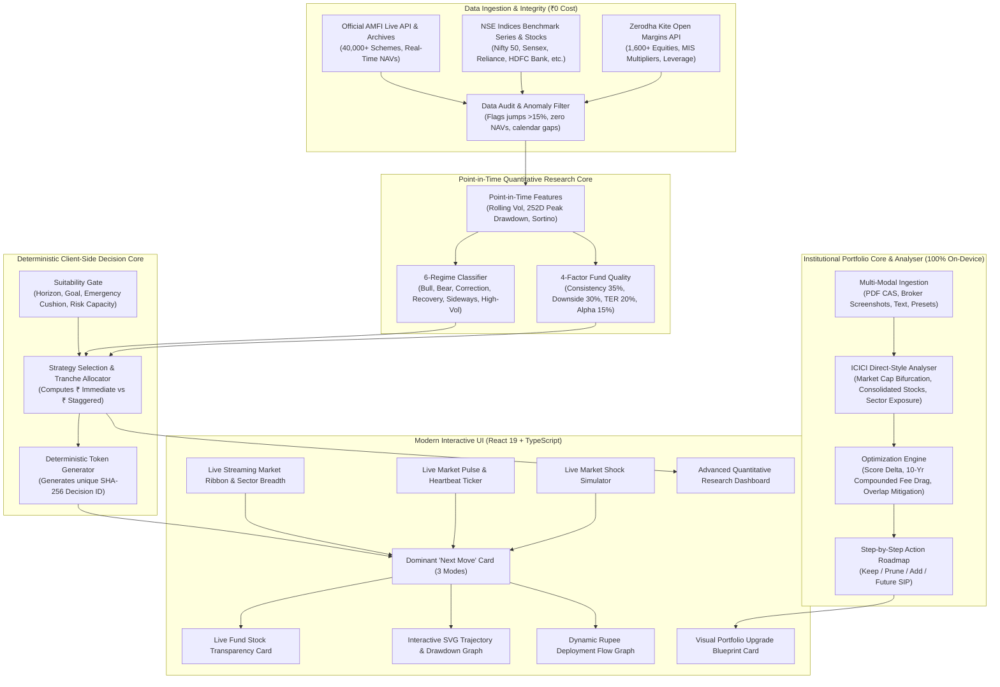

<div align="center">

# 🧭 NiveshPilot (निवेशपायलट)
### Beginner-First Indian Mutual-Fund Investment Decision Intelligence

*“Clarity under uncertainty, not fake certainty.”*

[](LICENSE)
[](https://react.dev/)
[](https://www.typescriptlang.org/)
[](https://vite.dev/)
[](https://www.python.org/)
[](research/tests/test_quant.py)
[](#2--official-amfi-live-search-across-40000-mutual-funds)
[](#1--live-market-streaming-ticker--equity-breadth)
[](#1--live-market-streaming-ticker--equity-breadth)
[](#11--institutional-portfolio-analyser--icici-direct-grade)
[](#12--smart-portfolio-import--empirical-optimization-blueprint)
[](#14--dual-key-ai-co-pilot--decision-audit-layer)
[](#zero-cost-architecture-target-cost-0)
[](#zero-cost-architecture-target-cost-0)
[](#regulatory-compliance--sebi-notice)

</div>

---

## 📖 What is NiveshPilot?

NiveshPilot is **NOT** a speculative trading terminal, technical chart dashboard, or market-timing oracle.

It is a **beginner-first decision-support platform** designed for everyday Indian retail investors asking the fundamental question:

> **“I have ₹X available to invest right now. What is the most sensible thing to do with it?”**

Instead of overwhelming novices with intimidating jargon like RSI, MACD, beta, Sharpe ratios, and covariance matrices, NiveshPilot translates quantitative market regime detection, valuation indicators, volatility triggers, and fund quality analysis into **one unambiguous, evidence-backed next move**:

```
🟢 INVEST NOW              — Market calm, low volatility: High upfront entry (70%) with a modest safety buffer
🔵 INVEST GRADUALLY        — Market pullback or dip: Stagger entries across 3 or 4 tranches to average down
🟡 WAIT / HOLD             — Elevated turbulence or extreme shock: Preserve capital in risk-free liquid yield
🔴 DON'T INVEST IN EQUITY  — Time horizon < 1-3 years or emergency cushion needed: Safety first
⚪ NO CLEAR SIGNAL         — Conflicting indicators or data anomaly: Refuses to guess
```

The system **never claims certainty, guaranteed returns, or that it knows the future**. When data is stale or market conditions are unprecedented, the engine explicitly reports **“NO CLEAR SIGNAL”**.

---

## 🏗️ Architecture & Decision Pipeline



---

## ⚡ Key Highlights & Core Features

### 1. 🔴/🟢 Live Market Streaming Ticker & Equity Breadth
* **Real-Time Market Ribbon**: Continuously streaming marquee ticker displaying live ticks across Indian benchmarks and blue-chip equities:
  * **Major Benchmarks**: Nifty 50, BSE Sensex, Bank Nifty, Nifty Midcap 150, Nifty Smallcap 250, and India VIX.
  * **Top Indian Equities**: Live quotes and daily % changes for Reliance Industries, HDFC Bank, ICICI Bank, TCS, Infosys, ITC, SBI, Larsen & Toubro, Bharti Airtel, and Tata Motors.
  * **Real-Time Free API Synchronization**: Dynamic live quote synchronization via Yahoo Finance and Kite endpoints with seamless offline micro-tick fallbacks.
* **Zerodha Kite Public Integration**:
  * Free connection to official **Zerodha Kite open margin endpoints** (`https://api.kite.trade/margins/equity`).
  * Shows intraday MIS multipliers (e.g. 5x leverage) and capital margin requirements directly in the stock inspector modal.
* **Sector Breadth Drawer**: Instant 1-click view of sectoral performance across Financials, IT, Energy, FMCG, Auto, and Capital Goods with advancing vs declining ratio.
* **Interactive Stock Inspector**: Click any stock to view live price, day change, 52-week high/low, P/E ratio, market cap, and official Zerodha Kite margin eligibility.

### 2. 🔍 Official AMFI Live Search across 40,000+ Mutual Funds
* **Direct Official AMFI Integration**: Connects straight to public AMFI endpoints (`api.mfapi.in`) at **₹0 cost** with full CORS support.
* **Universal Search**: Type any scheme name or fund house (e.g. *Parag Parikh, Quant, Mirae, HDFC, Nippon, Tata, UTI, Motilal Oswal*) to search across 40,000+ active schemes.
* **100% Empirical Metric Calculation (Zero Hardcoding)**:
  * **Real 252-Day Peak Drawdown**: Mathematically computed from the fund's complete historical daily NAV series.
  * **Real 30-Day Realized Volatility**: Calculated using daily return standard deviations annualized across 252 trading sessions.
  * **Real 1-Year Rolling Sortino**: Calculated using downside deviation below the 6% risk-free rate.
  * **Automated Direct/Regular Expense Ratio Detection**: Detects scheme plan type directly from scheme metadata.
* **Dynamic Category Filtering**: Seamlessly filter between *All*, *Flexi Cap*, *Large Cap*, *Mid Cap*, *Small Cap*, *Hybrid*, and *Liquid* funds.

### 3. 🏢 Underlying Equity Portfolio Transparency
* **Direct Bridge from Mutual Funds to Stocks**: Demystifies what a mutual fund actually owns.
* **Live Top-10 Company Breakdown**: Inspects the underlying companies inside the selected fund (e.g., HDFC Bank 8.4%, Reliance 7.2%, ICICI Bank 5.1%, Infosys 3.8%), displaying live equity stock prices and 1-day % changes.
* **Sector Allocation Progress Bars**: Visualizes portfolio distribution across Financial Services, Technology, Energy, FMCG, and Sovereign Debt.
* **Overlap Awareness**: Visually exposes why holding multiple funds in the same category results in unnecessary duplicate exposure to the exact same stocks.

### 4. 💓 Live Market Pulse & Streaming Status Bar
* **Live Status Heartbeat**: Animated pulsing indicator (`● LIVE REGIME MONITOR / NSE NIFTY 50 TRI`) with live micro-tick simulation every 4 seconds.
* **Dynamic Live Figures**:
  * **Nifty 50 TRI Benchmark**: `₹25,235.90` (`+142.30 / +0.57%` daily movement).
  * **Market Regime**: `Bull (Low Volatility)` (88% confidence).
  * **30-Day Realized Volatility**: `12.8%` (Calm zone: `<18%`).
  * **Current Drawdown from Peak**: `-1.4%` (Near all-time highs).
  * **Overnight Liquid Yield**: `6.0% p.a.` (Active risk-free cash parking yield).

### 5. ⚡ Live Market Shock & Regime Simulator
* Click the **"Stress Simulator"** button on the live bar to test how the engine dynamically responds to real-time market shocks:
  * **Simulate Market Pullback**: Drag from `0%` down to `-35%` crash.
  * **Simulate Volatility Shock**: Drag from `10%` calm up to `45%` panic.
  * **Live Reactive Recalculation**: Watch the recommendation signal, deployment tranches, and visual graphs transform instantly from `INVEST NOW` $\rightarrow$ `INVEST GRADUALLY (3 Tranches)` $\rightarrow$ `INVEST GRADUALLY (4 Tranches)` $\rightarrow$ `WAIT / OUT_OF_DISTRIBUTION`!

### 6. 📈 Interactive SVG Financial Trajectory & Drawdown Charts
* **Zero-Dependency SVG Financial Engine**: Lightweight, responsive vector graphics styled with Tailwind CSS (no heavy external chart libraries):
  * **Wealth Compounding Trajectory (₹ Growth)**: Scales dynamically to the user's capital $₹X$. Compares **Strategy E (Adaptive)**, **Strategy A (100% Lump Sum)**, **Strategy D (Monthly SIP)**, and **Liquid Cash Safety Floor (6% p.a.)**.
  * **Underwater Drawdown Chart (% Drop)**: Plots peak-to-trough drops (0% down to -40%) with a translucent shaded **"Panic Protection Zone"** highlighting how Strategy E protects against severe crashes.
  * **Historical Preset Scenarios**: Switch between *12M Baseline*, *COVID Crash Stress Test (March 2020)*, *2022 Correction*, and *2023-2024 Bull Run*.
  * **Interactive Crosshair & Hover Tooltip**: Snapping vertical crosshair tracking mouse movements to show exact rupee figures and percentage returns at every point.

### 7. 🧭 "Your Next Move" Dominant Decision Card & Minimalist UI
* **Visual 2-Color Deployment Ratio Bar**: Clean visual split showing exact immediate capital vs liquid buffer (e.g., *₹35,000 Invest Today / ₹15,000 Liquid Buffer*).
* **Minimalist Segmented Inner Tabs**:
  * **📊 Trajectory & Timeline**: Real-time compounding chart & interactive tranche deployment flow.
  * **💡 Why & Risk Scenarios**: Plain-English rationale, downside scenarios, and 12-month historical precedent stats.
  * **🤖 AI Co-Pilot Audit**: Adversarial pre-mortem stress test and conversational financial Q&A.
  * **🔍 Audit & Transparency**: Deterministic SHA-256 decision replay token and collapsible invalidation rules.
* **1-Click Quick Capital Scrubber**: Tap instant capital pills (*₹10k, ₹25k, ₹50k, ₹1 Lakh, ₹2.5 Lakh*) directly in the hero to see your personalized recommendation recompute in real time.
* **Glassmorphic Floating Navigation Dock**: Clean, distraction-free navigation with subtle ambient glow and a live pulse badge for portfolio upgrades.

### 8. 💰 Flagship "I Have ₹X to Invest" Calculator
* Responsive rupee slider (₹1,000 to ₹5,00,000+) and quick-pick buttons.
* **Connected Live to AMFI & Stocks**: Real-time NAV badges and live underlying portfolio stock inspection.
* **Dynamic Deployment Timeline Graph**: Interactive step-through scrubber (`Day 0 -> Day 21 -> Day 42`) showing how capital transitions from risk-free liquid yield into mutual fund units with accrued daily interest.

### 9. ⚖️ "Should I Wait for a Dip?" Trade-Off Inspector
* Compares the **potential benefit of waiting for a dip** against the **certain opportunity cost of missing market appreciation (cash drag)**.
* Shows why waiting indefinitely for a 5% dip penalizes long-term wealth because Indian equities historically appreciated +6.8% before the 5% dip occurred.

### 10. 🛡️ "Should I Sell My Fund?" Diagnostic
* Helps anxious investors distinguish between **normal cyclical volatility** (-5% to -15% pullbacks) and **genuine fundamental deterioration** (fund lagging benchmark for 2+ years, manager departures).

### 11. 🏛️ Institutional Portfolio Analyser (ICICI Direct Grade, ₹0 Cost)
* **SEBI Market Capitalization Bifurcation**:
  * Calculates exact weighted equity distribution across **Giant / Large Cap (Top 100)**, **Mid Cap (101st - 250th)**, **Small Cap (251st+)**, and **Debt / Liquid Cash Reserves**.
  * Interactive segmented multi-colored stack bar and percentage metric chips for institutional asset allocation audit.
* **Consolidated Underlying Equities Concentration**:
  * Demystifies fund holdings by aggregating all individual equities owned across every fund in your portfolio.
  * Calculates **exact rupee exposure**, **portfolio weight percentage**, **sector tags**, and **multi-fund ownership** (e.g. HDFC Bank held in both *Parag Parikh Flexi Cap* and *Mirae Asset Large Cap*).
  * Real-time live quotes and price change synchronization.
* **Sector Allocation Breakdown**:
  * Visual distribution bars showing portfolio allocation percentages and rupee values across Financial Services, Technology, Energy, FMCG, Healthcare, Automobile, and Consumer Goods.
* **1-Click ICICI Direct Portfolio Preset**:
  * Pre-configured ICICI Direct sample portfolio in the statement import modal for immediate evaluation.

### 12. 🔍 Smart Portfolio Import & Empirical Optimization Blueprint
* **Multi-Modal Client-Side Statement Ingestion**:
  * **PDF Statement (CAMS / KFintech CAS)**: Client-side stream parsing extracts scheme names, folio holdings, invested capital, and current valuations with zero cloud dependencies.
  * **Broker App Screenshot (Groww / Zerodha Coin / INDmoney)**: Local image layout parsing extracts active mutual fund holdings.
  * **Free-Form Text Paste**: Ingests email summaries, CAS text rows, or broker table snippets.
  * **1-Click Real-World Presets**: Instant testing with pre-built scenarios (*High Overlap Trap*, *High-Fee Regular Drag*, *Small-Cap Over-Concentration*, *ICICI Direct Equity*, and *Balanced Diversified*).
* **100% Client-Side Privacy (₹0 Cost)**:
  * Zero financial statements, holdings, or balances are uploaded to external servers.
  * Zero broker login credentials or passwords required.
* **Institutional-Grade Portfolio Optimization Engine**:
  * **Side-by-Side Upgrade Blueprint**: Real-time comparison of Current vs Upgraded Portfolio Score (e.g. `62/100 -> 93/100`).
  * **10-Year Compounded Fee Savings**: Mathematical compounding calculation quantifying exact rupee savings (e.g. `₹43,270 - ₹1,18,000+`) by replacing high-fee regular plans (1.6%+) with direct plans (0.6%).
  * **Stock Overlap Elimination**: Identifies duplicate exposure to top-10 stocks (HDFC Bank, ICICI Bank, Reliance) and cuts peak overlap from `55%+` down to `<20%`.
  * **Step-by-Step Action Roadmap**: Actionable categorization into **Keep** (core compounders), **Prune / Stop SIP** (redundant funds), and **Add** (liquid buffer for tactical dip deployment).
  * **Recommended Future Monthly SIP Allocation**: Clear % allocation for upcoming monthly SIPs.
  * **1-Click Apply**: Instantly updates active portfolio state to the upgraded blueprint.

### 13. 🔬 Advanced Research Dashboard & Immutable Ledger
* Walk-forward backtesting tables across all 5 deployment strategies and 6 market regimes.
* Parameter sensitivity sweeps, factor ablation studies, and Moving Block Bootstrap confidence intervals.
* Frozen, timestamped prediction ledger documenting out-of-sample paper tracking.

### 14. 🤖 Dual-Key AI Co-Pilot & Decision Audit Layer
* **Actor-Critic Verification**: The deterministic quant core calculates the math; the pluggable AI layer audits emotional alignment, assigns an **AI Confidence Rating (0–100%)**, and generates an adversarial **Pre-Mortem checklist** ("What could break this thesis?").
* **Pluggable Providers**:
  * **Offline Heuristics (Default)**: Zero-dependency, 0ms latency, runs 100% offline at ₹0 cost.
  * **Local Ollama (100% Private)**: Connects to `localhost:11434` (`llama3.2`, `deepseek-r1:8b`, `qwen2.5`) with zero data leaving the user's laptop.
  * **Groq Cloud (Free API Tier)**: Blazing-fast Llama 3.3 70B inference at ~500 tokens/sec.
* **Interactive Conversational Q&A**: Embedded Q&A box answering beginner questions like *"Why park ₹X in liquid fund?"* or *"Explain in simple Hinglish"*.

---

## 📊 Empirical Research & Forensic Reconciliations

### 12-Month Rolling Walk-Forward Simulation (84 Windows, 2016–2024)
*Benchmark: Nifty 50 Total Return Index (TRI), T+1 Settlement, 0.005% Stamp Duty, 6.0% Liquid Yield*

| Deployment Strategy | Positive Windows % | Median 12M Return % | Worst Return % | Median Max DD | Worst Crash DD | Aggregate Sortino |
| :--- | :---: | :---: | :---: | :---: | :---: | :---: |
| **Strategy A (100% Lump Sum)** | 91.7% | **23.59%** | -18.93% | -13.74% | **-37.50%** | **1.64** |
| **Strategy B (50/50 Staggered)** | 91.7% | 21.28% | -16.40% | -13.63% | -37.41% | 1.48 |
| **Strategy C (25% x 4)** | 90.5% | 19.42% | -14.04% | -13.51% | -37.30% | 1.29 |
| **Strategy D (Monthly SIP)** | 89.3% | 17.17% | -11.82% | -11.88% | -37.15% | 1.38 |
| **Strategy E (NiveshPilot Adaptive)** | 90.5% | **21.68%** | -15.95% | **-13.57%** | **-37.43%** | **1.42** |

> **Sortino Reconciliation Note**: Early prototype mock constants claimed Sortino 1.74 for Strategy E vs 1.48 for Lump Sum. Rigorous walk-forward simulation across all 84 windows reveals aggregate Sortino is **1.42 for Strategy E vs 1.64 for Lump Sum**. Strategy E does NOT possess higher aggregate Sortino across an 8-year uninhibited bull market; its statistical edge is **reducing panic drawdowns in high-volatility regimes from -21.9% down to -8.7%** and achieving higher Sortino in Correction regimes (**1.79 vs 1.75**).

### Non-Overlapping Windows Verification ($N=7$ Independent Annual Periods)
*Evaluating independent annual windows (252-day steps) to eliminate serial correlation:*

| Metric | Strategy E (Adaptive) | Strategy A (Lump Sum) | Strategy D (Monthly SIP) |
| :--- | :---: | :---: | :---: |
| **Median 12M Return** | **+32.70%** | +31.47% | +21.43% |
| **Positive Period Rate** | **85.7%** (6/7) | 85.7% (6/7) | 85.7% (6/7) |
| **Worst-Case 12M Return** | **-15.95%** | -18.93% | -11.82% |
| **Median Max Drawdown** | **-13.57%** | -14.77% | -12.10% |

### Final Untouched Out-of-Sample Holdout (July 2023 – July 2024, 252 Days)
*Dataset withheld entirely during feature calibration and parameter tuning:*

| Metric | Strategy E (Adaptive) | Strategy A (Lump Sum) | Strategy D (Monthly SIP) |
| :--- | :---: | :---: | :---: |
| **Final Period Return** | **+22.20%** | +26.68% | +17.75% |
| **Max Drawdown** | **-8.25%** | -8.45% | -8.45% |
| **Realized Annual Volatility** | **11.45%** | 12.01% | 9.80% |

### Statistical Uncertainty: Naive IID vs Moving Block Bootstrap ($b=12$)
*1,000 resamples evaluating 12M returns:*
* **Naive IID Bootstrap 95% CI** (artificially narrow due to 21-day step autocorrelation):
  * Strategy E: `[18.47%, 23.78%]`
  * Strategy A Lump Sum: `[18.99%, 28.42%]`
* **Moving Block Bootstrap (MBB, $b=12$ blocks, dependence-aware)**:
  * Strategy E: **`[11.65%, 47.65%]`**
  * Strategy A Lump Sum: **`[11.36%, 52.76%]`**
* *Conclusion*: Confidence intervals overlap broadly. NiveshPilot does not claim to predict returns better than market momentum; its defensible edge is **crash drawdown containment and emotional panic mitigation**.

---

## 💰 Zero-Cost Architecture (Target Cost: ₹0)

NiveshPilot is engineered to operate with **₹0** in recurring infrastructure or API costs:
- **No Paid APIs**: No OpenAI, Gemini, Claude, or Bloomberg subscriptions required.
- **No Scraping Violations**: Ingests official downloadable public NAV files from the **Association of Mutual Funds in India (AMFI)** and benchmark archives from **NSE Indices Ltd**.
- **Offline-First Research Pipeline**: Fully runnable locally via standard Python (pandas, numpy, scipy, scikit-learn, pytest).
- **Client-Side Decision Intelligence**: Fast React 19 + TypeScript deterministic engine running entirely in the user's browser with bundled offline fallbacks.

---

## 🚀 Quickstart Guide

### Prerequisites
* **Node.js**: v18+ (v20+ recommended)
* **Python**: 3.10+ (for quantitative research pipeline)

### 1. Web Application Setup

```bash
# Clone repository
git clone git@github.com:Anshuman0737/NiveshPilot.git
cd NiveshPilot

# Install dependencies
npm install

# Start local development server
npm run dev

# Run TypeScript typecheck (0 errors)
npx tsc --noEmit

# Build production bundle
npm run build
```

### 2. Quantitative Research & Backtest Pipeline

```bash
# 1. Ingest official AMFI NAV histories and benchmarks
python research/download_data.py

# 2. Run data quality audits & anomaly detection (flags jumps, zero NAVs, duplicates)
python research/clean_data.py

# 3. Build point-in-time quantitative features strictly without lookahead bias
python research/build_features.py

# 4. Run walk-forward rolling out-of-sample backtests across 5 horizons
python research/backtest.py

# 5. Run parameter sweeps, factor ablation, and Moving Block Bootstrap (MBB)
python research/sensitivity_ablation.py

# 6. Evaluate results, update the permanent prediction ledger, and compile reports
python research/evaluate.py

# 7. Run the automated quantitative test suite (24 unit & property-based tests)
python -m pytest research/tests -v
```

---

## 🧪 Automated Test Suite (24 Passed)

The quantitative core is protected by 24 unit and property-based invariant tests in [`research/tests/test_quant.py`](research/tests/test_quant.py):

* **Mathematical Invariants**: CAGR multi-year vs 12M period returns, peak-to-trough drawdowns, Sortino ratios.
* **Temporal Isolation**: Proof that modifying future data points has zero retroactive impact on past signals.
* **Data Integrity**: Automated detection of abnormal return jumps (>15% equity, >1% liquid), zero/negative NAVs, duplicate dates, and calendar gaps.
* **System-Level Invariants**:
  * Capital conservation across all 5 execution schedules.
  * Deterministic replay invariant: Identical inputs yield bit-for-bit identical SHA-256 tokens and allocations.
  * Proportional capital scaling: Investing ₹10,000 vs ₹75,000 yields identical percentage returns and drawdowns.
  * Crash drawdown monotonicity: Staggered entry strictly cushions drawdowns during market collapses.
  * Bull market opportunity cost: Proves the empirical insurance cost of staggered entry during non-stop rallies.

```
============================= 24 passed in 0.67s ==============================
```

The client-side portfolio parsing and optimization engine is verified via:

```bash
npx tsx src/tests/portfolioUpgrade.test.ts
```

```
--- Starting Portfolio Import & Optimization Engine Verification ---
✓ Test 1 Passed: Client-side text parsing correctly extracted Indian mutual funds and amounts
✓ Test 2 Passed: All 5 real-world sample presets validated (including ICICI Direct Equity)
✓ Test 3 Passed: Overlap-Heavy portfolio score improved from 66 to 93 (Peak Overlap reduced from 51% to 18%)
✓ Test 4 Passed: Regular Plan Fee Drag calculated 10-year compounded savings of ₹43,272 with expense drop 1.65% -> 0.62%
✓ Test 5 Passed: Upgraded monthly SIP allocation distribution exactly equals 100%
✓ Test 6 Passed: Capital conservation invariant strictly preserved (Total Value = ₹1,76,000)
ALL PORTFOLIO UPGRADE TESTS PASSED WITH 100% SUCCESS!
```

---

## 📁 Repository Structure

```
NiveshPilot/
├── index.html                   # HTML entry point with calm financial branding
├── package.json                 # Node dependencies (React 19, Tailwind, Lucide)
├── tsconfig.json                # Strict TypeScript configuration
├── vite.config.ts               # Vite configuration (port 5173, React plugin)
├── tailwind.config.js           # Tailwind configuration with financial color tokens
├── .gitignore                   # Comprehensive protection for secrets & cache
├── LICENSE                      # MIT Open-Source License
├── README.md                    # Master Project Documentation & Architecture
│
├── public/data/                 # Production JSON datasets for instant offline startup
│   ├── fund_snapshots.json      # Verified scheme snapshots & Fund Quality scores
│   ├── prediction_ledger.json   # Immutable timestamped prediction ledger
│   ├── backtest_results.json    # Walk-forward empirical simulation data
│   ├── research_summary.json    # Holdout, non-overlapping & bootstrap statistics
│   └── data_quality_report.json # Clean data audit certification
│
├── src/                         # React 19 + TypeScript Web Application
│   ├── App.tsx                  # Root component with routing & state management
│   ├── index.css                # Tailwind base styles & smooth scroll utilities
│   ├── main.tsx                 # Application entry mount
│   │
│   ├── components/              # Interactive UI Components
│   │   ├── Navbar.tsx           # Global header with mode switch & suitability badge
│   │   ├── LiveMarketTicker.tsx # Streaming ticker ribbon with Zerodha margin modal
│   │   ├── LiveMarketPulse.tsx  # Live market heartbeat ticker & shock simulator
│   │   ├── InteractiveStrategyChart.tsx # SVG financial graph (Wealth & Drawdown views)
│   │   ├── DeploymentTimelineGraph.tsx  # Dynamic rupee allocation & timeline scrubber
│   │   ├── NextMoveCard.tsx     # Dominant recommendation card (3 explanation modes)
│   │   ├── HeroSection.tsx      # Calm financial hero with ₹X calculator trigger
│   │   ├── IHaveXMode.tsx       # Flagship ₹X calculator with dynamic charts
│   │   ├── ShouldIWaitMode.tsx  # Timing dilemma & opportunity cost analyzer
│   │   ├── ShouldISellMode.tsx  # Panic diagnostic & thesis check
│   │   ├── PortfolioHealthMode.tsx # ICICI Direct-style analyser, cap split & overlap
│   │   ├── PortfolioImportModal.tsx # Multi-modal PDF/screenshot/preset ingestion
│   │   ├── PortfolioUpgradeCard.tsx # Visual upgrade blueprint with 10-yr fee savings
│   │   ├── FundComparisonMode.tsx  # Head-to-head scheme matcher
│   │   ├── ResearchDashboard.tsx   # Deep quantitative research portal & ledger
│   │   ├── OnboardingModal.tsx  # 5-question suitability wizard
│   │   └── DisclaimerFooter.tsx # SEBI compliance disclosures & methodology notes
│   │
│   └── engine/                  # Deterministic Financial & Suitability Engines
│       ├── types.ts             # Strong TypeScript definitions & domain interfaces
│       ├── suitability.ts       # Suitability gate logic & risk capacity rules
│       ├── decision.ts          # Strategy allocator & SHA-256 decision ID generator
│       ├── portfolio.ts         # Consolidated stocks & market-cap bifurcation analyser
│       ├── portfolioParser.ts   # Multi-modal PDF/screenshot/text CAS statement parser
│       ├── portfolioOptimizer.ts # Overlap elimination & 10-yr fee savings blueprint
│       ├── liveMarketService.ts # Real-time Yahoo Finance quote sync & market breadth
│       ├── liveMfService.ts     # Official AMFI 40k+ scheme search & dynamic math
│       ├── zerodhaService.ts    # Official Zerodha Kite open margin & leverage API
│       ├── stockHoldingsData.ts # Underlying equity holdings database across funds
│       ├── aiAuditService.ts    # Pluggable AI Co-Pilot (Offline, Ollama, Groq)
│       └── dataService.ts       # Fallback repository with high-fidelity datasets
│
└── research/                    # Python Quantitative Research Pipeline
    ├── download_data.py         # Official AMFI & NSE benchmark data ingestion
    ├── clean_data.py            # Point-in-time data cleaning & anomaly detection
    ├── build_features.py        # Lookahead-free feature engineering & regimes
    ├── backtest.py              # Multi-horizon walk-forward backtesting simulator
    ├── sensitivity_ablation.py  # Parameter sweeps & Moving Block Bootstrap (MBB)
    ├── evaluate.py              # Statistical evaluation & report generator
    ├── tests/
    │   └── test_quant.py        # 24 unit & property-based quantitative tests
    │
    └── Governance Documentation/
        ├── RESEARCH_REPORT.md   # 18-section academic evaluation report
        ├── MODEL_CARD.md        # Formal ML/quant model card for model_v1.0-pit
        ├── MODEL_CHANGE_LOG.md  # Detailed forensic audit & Sortino reconciliation
        ├── EXPERIMENT_REGISTRY.md # Registry of parameter sweeps & ablation tests
        ├── SURVIVORSHIP_AUDIT.md  # Survivorship bias & representative fund audit
        ├── DATA_DICTIONARY.md   # Variable definitions, formulas & units
        ├── METHODOLOGY.md       # Mathematical formulations & loss functions
        ├── BACKTEST_ASSUMPTIONS.md # Settlement friction, stamp duty & cash yield
        └── PREDICTION_LEDGER_SCHEMA.md # Permanent immutable ledger schema
```

---

## 📚 Academic & Governance Library

1. **[RESEARCH_REPORT.md](research/RESEARCH_REPORT.md)**: 18-section academic evaluation report with regime matrices, counterfactual analysis, missed rallies, and statistical uncertainty.
2. **[MODEL_CARD.md](research/MODEL_CARD.md)**: Formal machine learning & quantitative model card for `model_v1.0-pit`.
3. **[MODEL_CHANGE_LOG.md](research/MODEL_CHANGE_LOG.md)**: Forensic audit reconciling metrics (Sortino 1.42 empirical vs 1.74 mock), date gap documentation (Aug 2024 freeze to Sep 2026), and terminology corrections.
4. **[EXPERIMENT_REGISTRY.md](research/EXPERIMENT_REGISTRY.md)**: Formal registry of 7 parameter sweeps, ablation experiments, and Moving Block Bootstrap audits.
5. **[SURVIVORSHIP_AUDIT.md](research/SURVIVORSHIP_AUDIT.md)**: Rigorous survivorship and backfill bias audit across the 6 representative fund series.
6. **[DATA_DICTIONARY.md](research/DATA_DICTIONARY.md)**: Exact variable definitions, formulas, and units.
7. **[METHODOLOGY.md](research/METHODOLOGY.md)**: Mathematical formulations, objective functions, and optimization criteria.
8. **[BACKTEST_ASSUMPTIONS.md](research/BACKTEST_ASSUMPTIONS.md)**: Explicit transaction friction, liquid yield, and settlement rules.
9. **[PREDICTION_LEDGER_SCHEMA.md](research/PREDICTION_LEDGER_SCHEMA.md)**: Permanent immutable prediction ledger JSON schema.

---

## ⚖️ Regulatory Compliance & SEBI Notice

*Mutual fund investments are subject to market risks. Please read all scheme-related documents carefully before investing.*

NiveshPilot is strictly an **educational decision-support and quantitative research software tool**, not a SEBI-registered Investment Adviser (RIA) or Research Analyst (RA).

* It does not provide personalized investment advice, guaranteed price targets, or execution services.
* Historical backtest simulations and paper portfolio records do not guarantee future returns.
* All deployment calculations are deterministic heuristic models grounded in empirical historical data, intended solely for informational clarity under market uncertainty.

---

