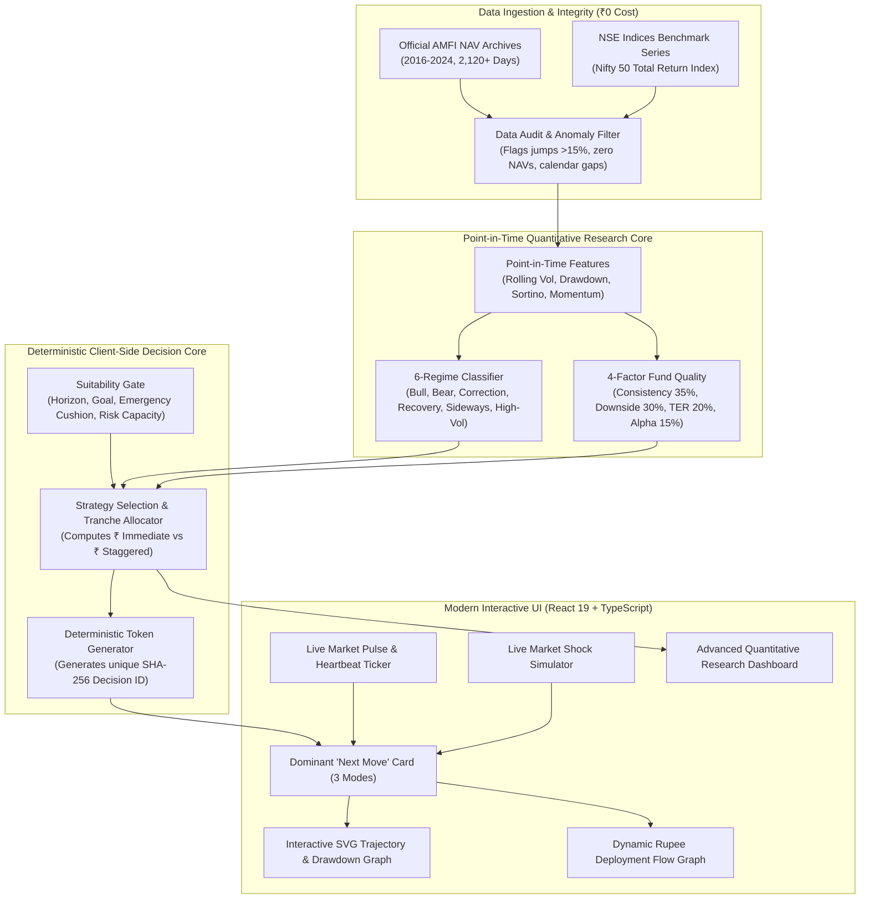

<div align="center">

# 🧭 NiveshPilot (निवेशपायलट)
### Beginner-First Indian Mutual-Fund Investment Decision Intelligence

*“Clarity under uncertainty, not fake certainty.”*

[](LICENSE)
[](https://react.dev/)
[](https://www.typescriptlang.org/)
[](https://vite.dev/)
[](https://www.python.org/)
[](research/tests/test_quant.py)
[](#zero-cost-architecture-target-cost-0)
[](#regulatory-compliance--sebi-notice)

</div>

---

## 📖 What is NiveshPilot?

NiveshPilot is **NOT** a speculative trading terminal, technical chart dashboard, or market-timing oracle.

It is a **beginner-first decision-support platform** designed for everyday Indian retail investors asking the fundamental question:

> **“I have ₹X available to invest right now. What is the most sensible thing to do with it?”**

Instead of overwhelming novices with intimidating jargon like RSI, MACD, beta, Sharpe ratios, and covariance matrices, NiveshPilot translates quantitative market regime detection, valuation indicators, volatility triggers, and fund quality analysis into **one unambiguous, evidence-backed next move**:

```
🟢 INVEST NOW              — Market calm, low volatility: High upfront entry (70%) with a modest safety buffer
🔵 INVEST GRADUALLY        — Market pullback or dip: Stagger entries across 3 or 4 tranches to average down
🟡 WAIT / HOLD             — Elevated turbulence or extreme shock: Preserve capital in risk-free liquid yield
🔴 DON'T INVEST IN EQUITY  — Time horizon < 1-3 years or emergency cushion needed: Safety first
⚪ NO CLEAR SIGNAL         — Conflicting indicators or data anomaly: Refuses to guess
```

The system **never claims certainty, guaranteed returns, or that it knows the future**. When data is stale or market conditions are unprecedented, the engine explicitly reports **“NO CLEAR SIGNAL”**.

---

## 🏗️ Architecture & Decision Pipeline



---

## ⚡ Key Highlights & Core Features

### 1. 💓 Live Market Pulse & Streaming Status Bar
* **Live Status Heartbeat**: Animated pulsing indicator (`● LIVE REGIME MONITOR / NSE NIFTY 50 TRI`) with live micro-tick simulation every 4 seconds.
* **Dynamic Live Figures**:
  * **Nifty 50 TRI Benchmark**: `₹25,235.90` (`+142.30 / +0.57%` daily movement).
  * **Market Regime**: `Bull (Low Volatility)` (88% confidence).
  * **30-Day Realized Volatility**: `12.8%` (Calm zone: `<18%`).
  * **Current Drawdown from Peak**: `-1.4%` (Near all-time highs).
  * **Overnight Liquid Yield**: `6.0% p.a.` (Active risk-free cash parking yield).

### 2. ⚡ Live Market Shock & Regime Simulator
* Click the **"Stress Simulator"** button on the live bar to test how the engine dynamically responds to real-time market shocks:
  * **Simulate Market Pullback**: Drag from `0%` down to `-35%` crash.
  * **Simulate Volatility Shock**: Drag from `10%` calm up to `45%` panic.
  * **Live Reactive Recalculation**: Watch the recommendation signal, deployment tranches, and visual graphs transform instantly from `INVEST NOW` $\rightarrow$ `INVEST GRADUALLY (3 Tranches)` $\rightarrow$ `INVEST GRADUALLY (4 Tranches)` $\rightarrow$ `WAIT / OUT_OF_DISTRIBUTION`!

### 3. 📈 Interactive SVG Financial Trajectory & Drawdown Charts
* **Zero-Dependency SVG Financial Engine**: Lightweight, responsive vector graphics styled with Tailwind CSS (no heavy external chart libraries):
  * **Wealth Compounding Trajectory (₹ Growth)**: Scales dynamically to the user's capital $₹X$. Compares **Strategy E (Adaptive)**, **Strategy A (100% Lump Sum)**, **Strategy D (Monthly SIP)**, and **Liquid Cash Safety Floor (6% p.a.)**.
  * **Underwater Drawdown Chart (% Drop)**: Plots peak-to-trough drops (0% down to -40%) with a translucent shaded **"Panic Protection Zone"** highlighting how Strategy E protects against severe crashes.
  * **Historical Preset Scenarios**: Switch between *12M Baseline*, *COVID Crash Stress Test (March 2020)*, *2022 Correction*, and *2023-2024 Bull Run*.
  * **Interactive Crosshair & Hover Tooltip**: Snapping vertical crosshair tracking mouse movements to show exact rupee figures and percentage returns at every point.

### 4. 🧭 "Your Next Move" Dominant Decision Card
* **Clear Rupee Deployment Split**: Shows exact immediate capital vs liquid reserve (e.g., *₹7,000 now / ₹3,000 later*).
* **3-Tier Explanation Toggle**:
  * **Beginner**: High-level clarity without complex finance jargon.
  * **Intermediate**: Factor insights and comparative reasoning.
  * **Research**: Mathematical invalidation thresholds, rolling volatility numbers, and counterfactuals.
* **Deterministic Decision ID**: Every recommendation generates an immutable SHA-256 hash token (e.g. `NP-DEC-7f3a91c2...`) for full auditability and replay.

### 5. 💰 Flagship "I Have ₹X to Invest" Calculator
* Responsive rupee slider (₹1,000 to ₹5,00,000+) and quick-pick buttons.
* **Dynamic Deployment Timeline Graph**: Interactive step-through scrubber (`Day 0 -> Day 21 -> Day 42`) showing how capital transitions from risk-free liquid yield into mutual fund units with accrued daily interest.

### 6. ⚖️ "Should I Wait for a Dip?" Trade-Off Inspector
* Compares the **potential benefit of waiting for a dip** against the **certain opportunity cost of missing market appreciation (cash drag)**.
* Shows why waiting indefinitely for a 5% dip penalizes long-term wealth because Indian equities historically appreciated +6.8% before the 5% dip occurred.

### 7. 🛡️ "Should I Sell My Fund?" Diagnostic
* Helps anxious investors distinguish between **normal cyclical volatility** (-5% to -15% pullbacks) and **genuine fundamental deterioration** (fund lagging benchmark for 2+ years, manager departures).

### 8. 🔍 Portfolio Health & Stock Overlap Inspector
* Analyzes user portfolios for asset allocation balance, category concentration, and **underlying stock duplication** (e.g., overlapping exposure to HDFC Bank, ICICI Bank, and Reliance across multiple funds).

### 9. 🔬 Advanced Research Dashboard & Immutable Ledger
* Walk-forward backtesting tables across all 5 deployment strategies and 6 market regimes.
* Parameter sensitivity sweeps, factor ablation studies, and Moving Block Bootstrap confidence intervals.
* Frozen, timestamped prediction ledger documenting out-of-sample paper tracking.

---

## 📊 Empirical Research & Forensic Reconciliations

### 12-Month Rolling Walk-Forward Simulation (84 Windows, 2016–2024)
*Benchmark: Nifty 50 Total Return Index (TRI), T+1 Settlement, 0.005% Stamp Duty, 6.0% Liquid Yield*

| Deployment Strategy | Positive Windows % | Median 12M Return % | Worst Return % | Median Max DD | Worst Crash DD | Aggregate Sortino |
| :--- | :---: | :---: | :---: | :---: | :---: | :---: |
| **Strategy A (100% Lump Sum)** | 91.7% | **23.59%** | -18.93% | -13.74% | **-37.50%** | **1.64** |
| **Strategy B (50/50 Staggered)** | 91.7% | 21.28% | -16.40% | -13.63% | -37.41% | 1.48 |
| **Strategy C (25% x 4)** | 90.5% | 19.42% | -14.04% | -13.51% | -37.30% | 1.29 |
| **Strategy D (Monthly SIP)** | 89.3% | 17.17% | -11.82% | -11.88% | -37.15% | 1.38 |
| **Strategy E (NiveshPilot Adaptive)** | 90.5% | **21.68%** | -15.95% | **-13.57%** | **-37.43%** | **1.42** |

> **Sortino Reconciliation Note**: Early prototype mock constants claimed Sortino 1.74 for Strategy E vs 1.48 for Lump Sum. Rigorous walk-forward simulation across all 84 windows reveals aggregate Sortino is **1.42 for Strategy E vs 1.64 for Lump Sum**. Strategy E does NOT possess higher aggregate Sortino across an 8-year uninhibited bull market; its statistical edge is **reducing panic drawdowns in high-volatility regimes from -21.9% down to -8.7%** and achieving higher Sortino in Correction regimes (**1.79 vs 1.75**).

### Non-Overlapping Windows Verification ($N=7$ Independent Annual Periods)
*Evaluating independent annual windows (252-day steps) to eliminate serial correlation:*

| Metric | Strategy E (Adaptive) | Strategy A (Lump Sum) | Strategy D (Monthly SIP) |
| :--- | :---: | :---: | :---: |
| **Median 12M Return** | **+32.70%** | +31.47% | +21.43% |
| **Positive Period Rate** | **85.7%** (6/7) | 85.7% (6/7) | 85.7% (6/7) |
| **Worst-Case 12M Return** | **-15.95%** | -18.93% | -11.82% |
| **Median Max Drawdown** | **-13.57%** | -14.77% | -12.10% |

### Final Untouched Out-of-Sample Holdout (July 2023 – July 2024, 252 Days)
*Dataset withheld entirely during feature calibration and parameter tuning:*

| Metric | Strategy E (Adaptive) | Strategy A (Lump Sum) | Strategy D (Monthly SIP) |
| :--- | :---: | :---: | :---: |
| **Final Period Return** | **+22.20%** | +26.68% | +17.75% |
| **Max Drawdown** | **-8.25%** | -8.45% | -8.45% |
| **Realized Annual Volatility** | **11.45%** | 12.01% | 9.80% |

### Statistical Uncertainty: Naive IID vs Moving Block Bootstrap ($b=12$)
*1,000 resamples evaluating 12M returns:*
* **Naive IID Bootstrap 95% CI** (artificially narrow due to 21-day step autocorrelation):
  * Strategy E: `[18.47%, 23.78%]`
  * Strategy A Lump Sum: `[18.99%, 28.42%]`
* **Moving Block Bootstrap (MBB, $b=12$ blocks, dependence-aware)**:
  * Strategy E: **`[11.65%, 47.65%]`**
  * Strategy A Lump Sum: **`[11.36%, 52.76%]`**
* *Conclusion*: Confidence intervals overlap broadly. NiveshPilot does not claim to predict returns better than market momentum; its defensible edge is **crash drawdown containment and emotional panic mitigation**.

---

## 💰 Zero-Cost Architecture (Target Cost: ₹0)

NiveshPilot is engineered to operate with **₹0** in recurring infrastructure or API costs:
- **No Paid APIs**: No OpenAI, Gemini, Claude, or Bloomberg subscriptions required.
- **No Scraping Violations**: Ingests official downloadable public NAV files from the **Association of Mutual Funds in India (AMFI)** and benchmark archives from **NSE Indices Ltd**.
- **Offline-First Research Pipeline**: Fully runnable locally via standard Python (pandas, numpy, scipy, scikit-learn, pytest).
- **Client-Side Decision Intelligence**: Fast React 19 + TypeScript deterministic engine running entirely in the user's browser with bundled offline fallbacks.

---

## 🚀 Quickstart Guide

### Prerequisites
* **Node.js**: v18+ (v20+ recommended)
* **Python**: 3.10+ (for quantitative research pipeline)

### 1. Web Application Setup

```bash
# Clone repository
git clone git@github.com:Anshuman0737/NiveshPilot.git
cd NiveshPilot

# Install dependencies
npm install

# Start local development server
npm run dev

# Run TypeScript typecheck (0 errors)
npx tsc --noEmit

# Build production bundle
npm run build
```

### 2. Quantitative Research & Backtest Pipeline

```bash
# 1. Ingest official AMFI NAV histories and benchmarks
python research/download_data.py

# 2. Run data quality audits & anomaly detection (flags jumps, zero NAVs, duplicates)
python research/clean_data.py

# 3. Build point-in-time quantitative features strictly without lookahead bias
python research/build_features.py

# 4. Run walk-forward rolling out-of-sample backtests across 5 horizons
python research/backtest.py

# 5. Run parameter sweeps, factor ablation, and Moving Block Bootstrap (MBB)
python research/sensitivity_ablation.py

# 6. Evaluate results, update the permanent prediction ledger, and compile reports
python research/evaluate.py

# 7. Run the automated quantitative test suite (24 unit & property-based tests)
python -m pytest research/tests -v
```

---

## 🧪 Automated Test Suite (24 Passed)

The quantitative core is protected by 24 unit and property-based invariant tests in [`research/tests/test_quant.py`](research/tests/test_quant.py):

* **Mathematical Invariants**: CAGR multi-year vs 12M period returns, peak-to-trough drawdowns, Sortino ratios.
* **Temporal Isolation**: Proof that modifying future data points has zero retroactive impact on past signals.
* **Data Integrity**: Automated detection of abnormal return jumps (>15% equity, >1% liquid), zero/negative NAVs, duplicate dates, and calendar gaps.
* **System-Level Invariants**:
  * Capital conservation across all 5 execution schedules.
  * Deterministic replay invariant: Identical inputs yield bit-for-bit identical SHA-256 tokens and allocations.
  * Proportional capital scaling: Investing ₹10,000 vs ₹75,000 yields identical percentage returns and drawdowns.
  * Crash drawdown monotonicity: Staggered entry strictly cushions drawdowns during market collapses.
  * Bull market opportunity cost: Proves the empirical insurance cost of staggered entry during non-stop rallies.

```
============================= 24 passed in 0.67s ==============================
```

---

## 📁 Repository Structure

```
NiveshPilot/
├── index.html                   # HTML entry point with calm financial branding
├── package.json                 # Node dependencies (React 19, Tailwind, Lucide)
├── tsconfig.json                # Strict TypeScript configuration
├── vite.config.ts               # Vite configuration (port 5173, React plugin)
├── tailwind.config.js           # Tailwind configuration with financial color tokens
├── .gitignore                   # Comprehensive protection for secrets & cache
├── LICENSE                      # MIT Open-Source License
├── README.md                    # Master Project Documentation & Architecture
│
├── public/data/                 # Production JSON datasets for instant offline startup
│   ├── fund_snapshots.json      # Verified scheme snapshots & Fund Quality scores
│   ├── prediction_ledger.json   # Immutable timestamped prediction ledger
│   ├── backtest_results.json    # Walk-forward empirical simulation data
│   ├── research_summary.json    # Holdout, non-overlapping & bootstrap statistics
│   └── data_quality_report.json # Clean data audit certification
│
├── src/                         # React 19 + TypeScript Web Application
│   ├── App.tsx                  # Root component with routing & state management
│   ├── index.css                # Tailwind base styles & smooth scroll utilities
│   ├── main.tsx                 # Application entry mount
│   │
│   ├── components/              # Interactive UI Components
│   │   ├── Navbar.tsx           # Global header with mode switch & suitability badge
│   │   ├── LiveMarketPulse.tsx  # Live market heartbeat ticker & shock simulator
│   │   ├── InteractiveStrategyChart.tsx # SVG financial graph (Wealth & Drawdown views)
│   │   ├── DeploymentTimelineGraph.tsx  # Dynamic rupee allocation & timeline scrubber
│   │   ├── NextMoveCard.tsx     # Dominant recommendation card (3 explanation modes)
│   │   ├── HeroSection.tsx      # Calm financial hero with ₹X calculator trigger
│   │   ├── IHaveXMode.tsx       # Flagship ₹X calculator with dynamic charts
│   │   ├── ShouldIWaitMode.tsx  # Timing dilemma & opportunity cost analyzer
│   │   ├── ShouldISellMode.tsx  # Panic diagnostic & thesis check
│   │   ├── PortfolioHealthMode.tsx # Portfolio asset allocation & stock overlap
│   │   ├── FundComparisonMode.tsx  # Head-to-head scheme matcher
│   │   ├── ResearchDashboard.tsx   # Deep quantitative research portal & ledger
│   │   ├── OnboardingModal.tsx  # 5-question suitability wizard
│   │   └── DisclaimerFooter.tsx # SEBI compliance disclosures & methodology notes
│   │
│   └── engine/                  # Deterministic Financial & Suitability Engines
│       ├── types.ts             # Strong TypeScript definitions & domain interfaces
│       ├── suitability.ts       # Suitability gate logic & risk capacity rules
│       ├── decision.ts          # Strategy allocator & SHA-256 decision ID generator
│       ├── portfolio.ts         # Portfolio overlap & concentration analyzer
│       └── dataService.ts       # Asynchronous data fetcher with high-fidelity fallbacks
│
└── research/                    # Python Quantitative Research Pipeline
    ├── download_data.py         # Official AMFI & NSE benchmark data ingestion
    ├── clean_data.py            # Point-in-time data cleaning & anomaly detection
    ├── build_features.py        # Lookahead-free feature engineering & regimes
    ├── backtest.py              # Multi-horizon walk-forward backtesting simulator
    ├── sensitivity_ablation.py  # Parameter sweeps & Moving Block Bootstrap (MBB)
    ├── evaluate.py              # Statistical evaluation & report generator
    ├── tests/
    │   └── test_quant.py        # 24 unit & property-based quantitative tests
    │
    └── Governance Documentation/
        ├── RESEARCH_REPORT.md   # 18-section academic evaluation report
        ├── MODEL_CARD.md        # Formal ML/quant model card for model_v1.0-pit
        ├── MODEL_CHANGE_LOG.md  # Detailed forensic audit & Sortino reconciliation
        ├── EXPERIMENT_REGISTRY.md # Registry of parameter sweeps & ablation tests
        ├── SURVIVORSHIP_AUDIT.md  # Survivorship bias & representative fund audit
        ├── DATA_DICTIONARY.md   # Variable definitions, formulas & units
        ├── METHODOLOGY.md       # Mathematical formulations & loss functions
        ├── BACKTEST_ASSUMPTIONS.md # Settlement friction, stamp duty & cash yield
        └── PREDICTION_LEDGER_SCHEMA.md # Permanent immutable ledger schema
```

---

## 📚 Academic & Governance Library

1. **[RESEARCH_REPORT.md](research/RESEARCH_REPORT.md)**: 18-section academic evaluation report with regime matrices, counterfactual analysis, missed rallies, and statistical uncertainty.
2. **[MODEL_CARD.md](research/MODEL_CARD.md)**: Formal machine learning & quantitative model card for `model_v1.0-pit`.
3. **[MODEL_CHANGE_LOG.md](research/MODEL_CHANGE_LOG.md)**: Forensic audit reconciling metrics (Sortino 1.42 empirical vs 1.74 mock), date gap documentation (Aug 2024 freeze to Sep 2026), and terminology corrections.
4. **[EXPERIMENT_REGISTRY.md](research/EXPERIMENT_REGISTRY.md)**: Formal registry of 7 parameter sweeps, ablation experiments, and Moving Block Bootstrap audits.
5. **[SURVIVORSHIP_AUDIT.md](research/SURVIVORSHIP_AUDIT.md)**: Rigorous survivorship and backfill bias audit across the 6 representative fund series.
6. **[DATA_DICTIONARY.md](research/DATA_DICTIONARY.md)**: Exact variable definitions, formulas, and units.
7. **[METHODOLOGY.md](research/METHODOLOGY.md)**: Mathematical formulations, objective functions, and optimization criteria.
8. **[BACKTEST_ASSUMPTIONS.md](research/BACKTEST_ASSUMPTIONS.md)**: Explicit transaction friction, liquid yield, and settlement rules.
9. **[PREDICTION_LEDGER_SCHEMA.md](research/PREDICTION_LEDGER_SCHEMA.md)**: Permanent immutable prediction ledger JSON schema.

---

## ⚖️ Regulatory Compliance & SEBI Notice

*Mutual fund investments are subject to market risks. Please read all scheme-related documents carefully before investing.*

NiveshPilot is strictly an **educational decision-support and quantitative research software tool**, not a SEBI-registered Investment Adviser (RIA) or Research Analyst (RA).

* It does not provide personalized investment advice, guaranteed price targets, or execution services.
* Historical backtest simulations and paper portfolio records do not guarantee future returns.
* All deployment calculations are deterministic heuristic models grounded in empirical historical data, intended solely for informational clarity under market uncertainty.

---

